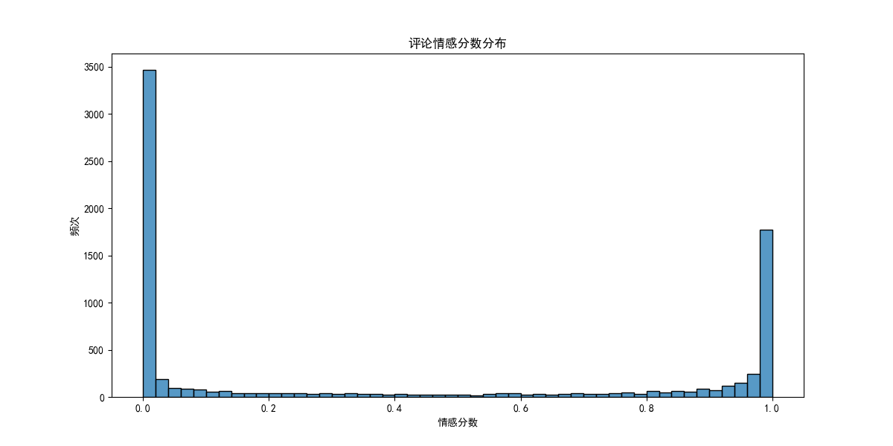

# 酒店评论情感分析系统 (Hotel Review Sentiment Analysis System)

[](https://www.python.org/)

这是一个基于 Python 的多功能情感分析项目，专注于处理酒店评论数据。项目实现了一套完整的文本处理与分析流程，从数据清洗、广告过滤到情感计算和结果可视化。

---

## ✨ 项目特色 (Features)

- **文本预处理**: 包括中文分词、去除停用词、过滤特殊符号等。
- **广告内容过滤**: 根据预设的关键词库，精准识别并移除无关的广告评论。
- **核心情感分析**: 使用 `sentiment_analysis_advanced.py` 等核心脚本进行情感倾向判断。
- **TF-IDF 算法**: 提取评论中的关键词及其权重。
- **丰富的可视化**: 自动生成词云图、词频分布图、词语共现网络图等，使分析结果一目了然。

---

## 📊 成果展示 (Results Showcase)

*这里展示了由程序自动生成的关键分析结果图，直观呈现数据洞察。*

### 1. 词云图 (Word Cloud)


### 2. 词语共现分析 (Word Co-occurrence Analysis)


### 3. 情感分数分布 (Sentiment Score Distribution)


### 4. 评论长度 vs 情感分数 (Review Length vs. Sentiment Score)


### 5. 主题分布热力图 (Topic Distribution Heatmap)


### 6. 项目结构框架图 (Project Structure Diagram)


## 🚀 如何开始 (Getting Started)

### 1. 环境依赖
建议创建一个 `requirements.txt` 文件，并将项目所需的库写入其中。这可以帮助其他人轻松地配置环境。

**requirements.txt 内容示例:**
```txt
jieba
pandas
numpy
scikit-learn
matplotlib
wordcloud


使用以下命令安装所有依赖：
pip install -r requirements.txt


2. 运行项目
在终端中运行主分析脚本：
python hotel_sentiment_analysis.py
(请根据你的实际主文件名修改)


📂 项目文件结构 (Project Structure)
.
├── assets/                  # 存放 README 中使用的图片
│   ├── 词云图.png
│   └── ...
├── 分析结果_.../            # 存放所有完整的分析结果
├── ChnSentiCorp_htl_all     # 原始数据集
├── 停用词汇总.txt           # 停用词词典
├── PreText.py               # 文本预处理脚本
├── hotel_sentiment_analysis.py # 主分析脚本
├── TF-IDF.py                # TF-IDF 算法脚本
└── README.md                # 项目说明文件

📝 许可证 (License)
本项目采用 MIT License 开源许可证。